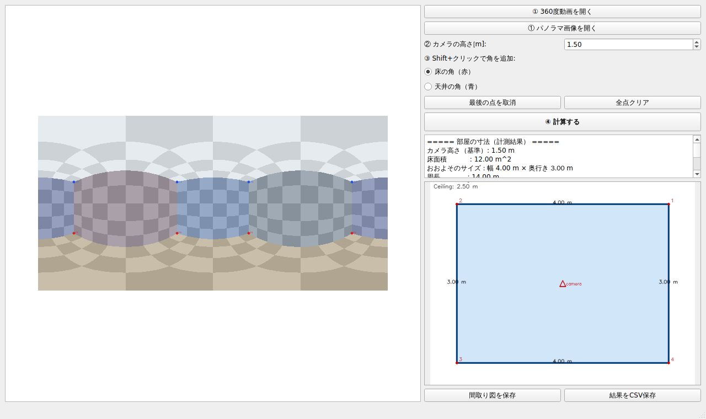

# 360度カメラ 部屋寸法計測ツール

360度カメラ（Ricoh Theta / Insta360 など）で撮影したパノラマ動画・画像から、
**部屋の寸法（幅・奥行き・天井高・床面積）と間取り図**を割り出すデスクトップアプリです。



---

## 仕組み（なぜ寸法が出せるのか）

360度パノラマ（正距円筒図法 / equirectangular）の各ピクセルは、カメラから見た
「方向（上下左右の角度）」に対応します。床と壁が接する「角」の方向と、
**カメラの床からの高さ**が分かれば、三角比でその角までの水平距離が計算できます。

```
水平距離 = カメラの高さ ÷ tan(見下ろし角)
```

これを部屋の各角について行うと、床の形（間取り）と各寸法が求まります。
天井の角を指定すれば、同じ原理で天井高も計算できます。

### ⚠️ 大切な前提：スケールの基準について

写真・動画だけでは「本物の部屋」と「ミニチュア」を区別できないため、
**何か1つの実寸基準**が必要です。本ツールでは最も簡単な
**「カメラ（三脚）の床からの高さ」** を基準に使います（初期値 1.5m）。

- 撮影時に三脚の高さをメジャーで測っておけば、正確な寸法が出ます。
- 高さが不明でも、**部屋の「形」と「縦横比」は正確**に出ます
  （カメラ高さを変えると寸法は比例して伸縮します）。

---

## インストール

```bash
cd room_measure_360
pip install -r requirements.txt
```

Linux でGUIを動かす場合、OpenGL関連のシステムライブラリが必要なことがあります:
```bash
sudo apt-get install -y libegl1 libgl1 libxkbcommon0 libdbus-1-3
```

---

## 使い方（デスクトップアプリ）

```bash
python3 app.py
```

1. **①** 「360度動画を開く」または「パノラマ画像を開く」
   （動画は自動で最も鮮明なフレームを選びます）
2. **②** カメラの高さ[m]を入力（撮影時の三脚の高さなど）
3. **③** 「床の角」を選び、**Shift+クリック**で部屋の角を一周する順にクリック
   （任意で「天井の角」も同様に指定すると天井高が出ます）
4. **④** 「計算する」で寸法と間取り図を表示
5. 「間取り図を保存」「結果をCSV保存」で書き出し

操作のヒント:
- **ホイール**で拡大縮小、**ドラッグ**で移動できます。
- 角は床と壁が接する点をできるだけ正確にクリックしてください。

---

## 使い方（コマンドライン）

実機の動画が無くても、デモ用の合成360度動画で試せます。

```bash
# デモ用の合成360度動画を生成（4m×3m×高さ2.5m の部屋）
python3 cli.py make-demo --out demo.mp4

# 動画から最も鮮明なフレームを抽出
python3 cli.py extract-frame --video demo.mp4 --out frame.png

# 角の座標(JSON)から寸法を計算し、間取り図を保存
python3 cli.py measure --image frame.png --points points.json \
    --camera-height 1.5 --out-plan plan.png
```

`points.json` の形式:
```json
{
  "floor":   [[x1,y1],[x2,y2],[x3,y3],[x4,y4]],
  "ceiling": [[x1,y1],[x2,y2],[x3,y3],[x4,y4]]
}
```

---

## 構成

```
room_measure_360/
├── app.py                  # デスクトップアプリ（PySide6）
├── cli.py                  # コマンドライン版
├── requirements.txt
├── room_measure/
│   ├── geometry.py         # ピクセル⇔角度⇔実寸 の幾何計算（心臓部）
│   ├── video.py            # 360度動画からの鮮明フレーム抽出
│   ├── render.py           # 間取り図の描画・結果テキスト
│   └── synthetic.py        # 検証・デモ用の合成パノラマ／動画生成
└── tests/
    ├── test_geometry.py    # 幾何計算の往復検証テスト
    └── test_app_smoke.py   # アプリの起動・計算スモークテスト
```

## テスト

```bash
python3 tests/test_geometry.py
QT_QPA_PLATFORM=offscreen python3 tests/test_app_smoke.py
```

---

## 今後の拡張（任意）

- AIによる部屋レイアウトの自動推定（角クリックの自動化, HorizonNet 等）
- 360度動画の複数フレームを使ったStructure-from-Motionによるスケール推定
- 非長方形・L字型の部屋への対応強化
- 3Dビューでの確認
